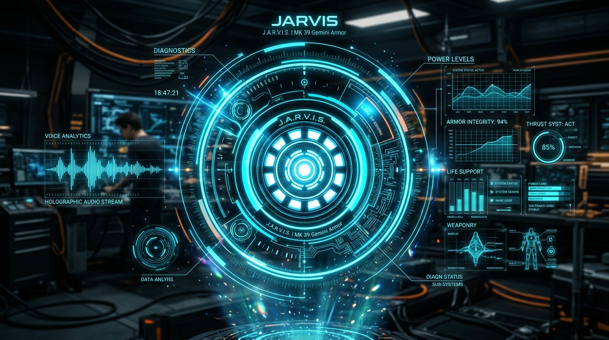
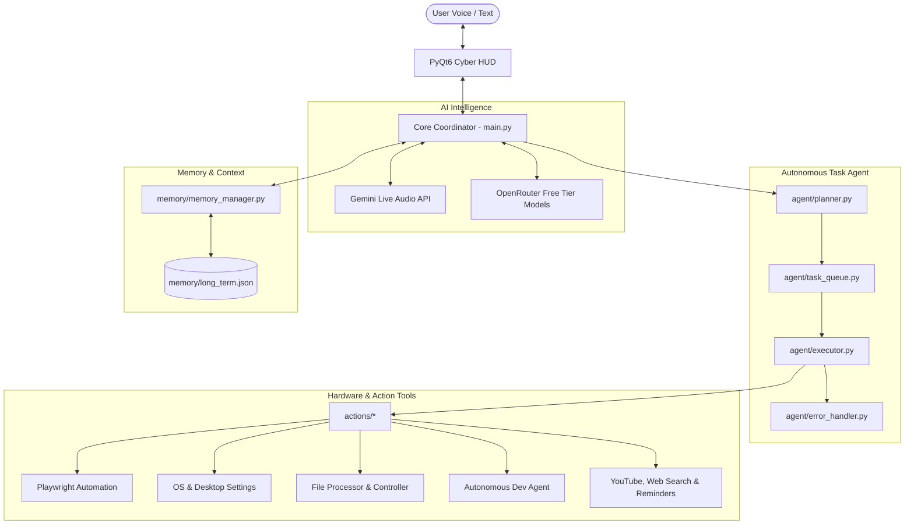

# ⚡ J.A.R.V.I.S — MARK XXXIX-OR

<div align="center">



### **The Autonomous Cross-Platform Voice And Visiosn Personal AI Assistants **

[](https://www.python.org/)
[](https://riverbankcomputing.com/software/pyqt/)
[](https://ai.google.dev/)
[](https://openrouter.ai/)
[](https://playwright.dev/)

</div>

---

## 🌌 Overview

**MARK XXXIX-OR** is an advanced Iron Man–inspired AI desktop assistant capable of real-time voice conversations, live vision analysis, autonomous multi-step workflow execution, file processing, and deep operating system control.

Featuring a futuristic cyber-HUD interface with live dynamic telemetry, audio visualizers, and long-term persistent memory, MARK XXXIX bridges natural human conversation with complete computer automation.

---

## 🚀 Key Features

| Capability | Description |
|---|---|
| 🎙️ **Real-Time Bidirectional Voice** | Ultra-low latency voice conversation powered by Gemini 2.5 Live Audio API with adaptive hardware microphone resampling. |
| ⌨️ **Hybrid Voice & Keyboard Input** | Switch seamlessly between voice and text commands in the HUD command bar. |
| 🤖 **Autonomous Multi-Step Agent** | Planner, Executor, and Error Handler that breaks down complex user goals into coordinated multi-tool tasks. |
| 👁️ **Visual & Screen Intelligence** | Real-time screen capture, webcam vision, OCR, and UI element targeting with multimodal AI. |
| 🌐 **Browser Automation** | Playwright-powered autonomous navigation, research, search, form filling, and web scraping. |
| 📁 **Multimodal File Processor** | Drag-and-drop document upload tray for analyzing PDFs, images, codebases, audio, video, and spreadsheets. |
| ⚙️ **Deep OS & Hardware Control** | Launch apps, adjust brightness/volume/Wi-Fi, control mouse/keyboard, take screenshots, and organize desktop clutter. |
| 🧠 **Persistent Long-Term Memory** | Remembers personal context, projects, habits, and preferences across sessions. |
| 🚀 **Silent Windows Boot Auto-Start** | 1-click startup registration to run invisibly upon PC boot without any terminal window. |

---

## 🛠️ System Architecture



---

## 📦 Installation & Setup

### 1. Clone the Repository
```bash
git clone https://github.com/shaheerkhan0012345-dotcom/Mark-XXXIX-OR.git
cd Mark-XXXIX-OR
```

### 2. Set Up Virtual Environment & Dependencies
```bash
# Create virtual environment
python -m venv .venv

# Activate virtual environment (Windows PowerShell)
.venv\Scripts\Activate.ps1

# Install requirements
pip install -r requirements.txt
playwright install chromium
```

### 3. Configure API Keys
Create or edit `config/api_keys.json` (see `config/api_keys.example.json`):
```json
{
  "gemini_api_key": "YOUR_GEMINI_API_KEY",
  "openrouter_api_key": "YOUR_OPENROUTER_API_KEY",
  "os_system": "windows"
}
```
> *Get a free Gemini API key from [Google AI Studio](https://aistudio.google.com/).*

---

## ⚡ Running JARVIS

### Option A: 1-Click Batch Runner
Double-click `run_jarvis.bat`.

### Option B: Silent Background Launcher (No Terminal Window)
Double-click `launch_jarvis_silent.vbs`.

### Option C: Enable Auto-Start on PC Boot
Double-click `enable_autostart.bat` to have JARVIS start automatically every time your PC turns on.  
*(Run `disable_autostart.bat` to disable).*

### Option D: Terminal Execution
```powershell
.venv\Scripts\python.exe main.py
```

---

## 🎮 How to Interact

* **Voice Mode**: Ensure your microphone is plugged in, wait for the status to show `LISTENING`, and speak naturally.
* **Keyboard Mode**: In the right panel under **`COMMAND INPUT`**, type any question or instruction and press **Enter**.
* **Mute Toggle**: Press `F4` or click `🎙 MICROPHONE ACTIVE` to mute the microphone.
* **Fullscreen**: Press `F11`.
* **File Analysis**: Drag and drop any image, PDF, audio, or document into the HUD dropzone.

---

## 📁 Repository Structure

```
├── actions/                  # 16 modular capability tools (browser, dev agent, files, settings, etc.)
├── agent/                    # Autonomous multi-step planner, executor, and error recovery engine
├── assets/                   # UI banners and media resources
├── config/                   # Configuration management & API settings template
├── core/                     # System identity prompts and personality definitions
├── memory/                   # Long-term persistent contextual memory subsystem
├── main.py                   # Central live audio streaming loop and tool orchestrator
├── ui.py                     # PyQt6 Stark HUD interface with particle animations and telemetry
├── or_client.py              # OpenRouter delegation client with model failover
├── run_jarvis.bat            # 1-click startup launcher
├── launch_jarvis_silent.vbs  # Windowless silent launcher (pythonw.exe)
├── enable_autostart.bat      # Windows boot auto-start registrar
├── disable_autostart.bat     # Windows boot auto-start remover
└── requirements.txt          # Python dependency specifications
```

---

## 📄 License

Personal and educational use. Licensed under **[Creative Commons BY-NC 4.0](https://creativecommons.org/licenses/by-nc/4.0/)**.

---

<div align="center">
<b>Engineered by Muhammad Shaheer</b>
</div>
